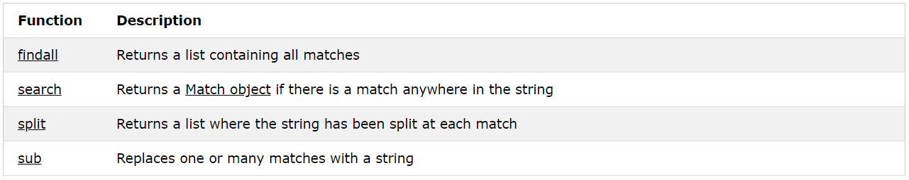
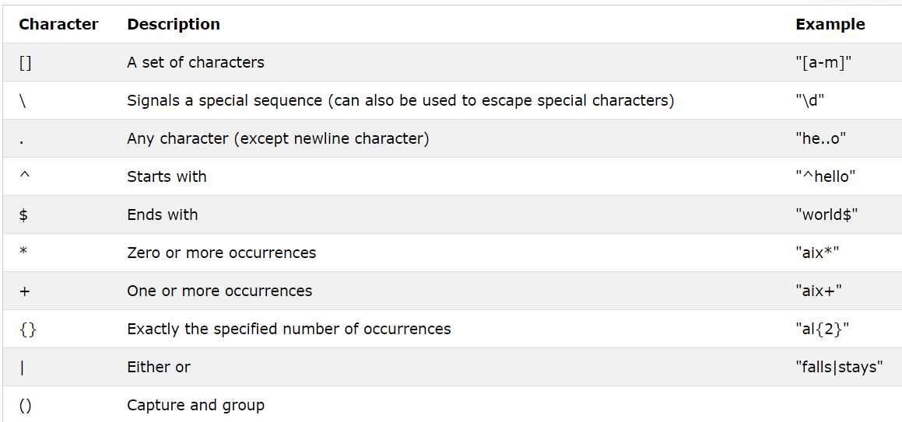
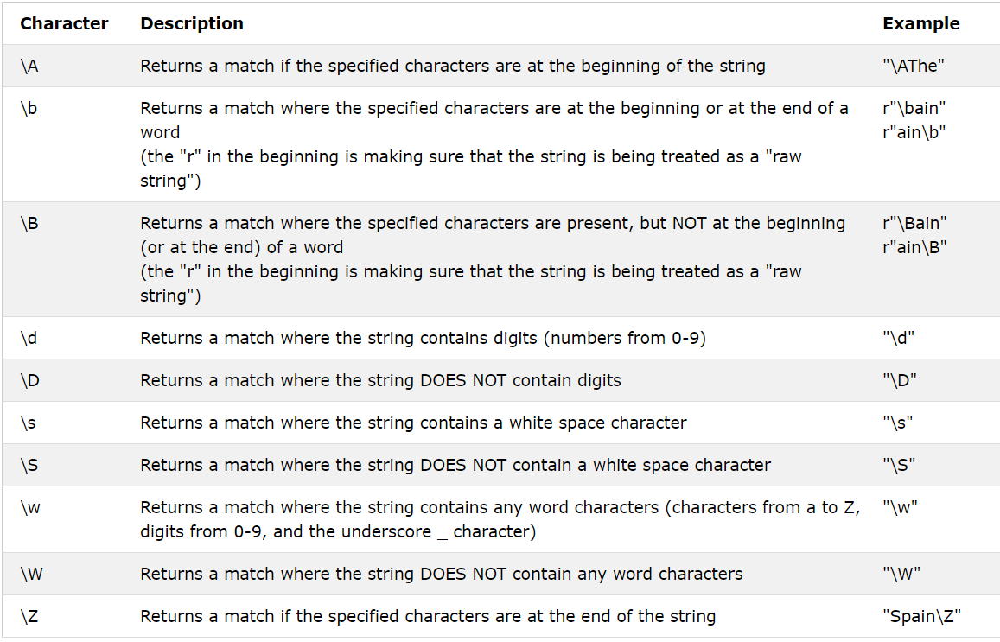
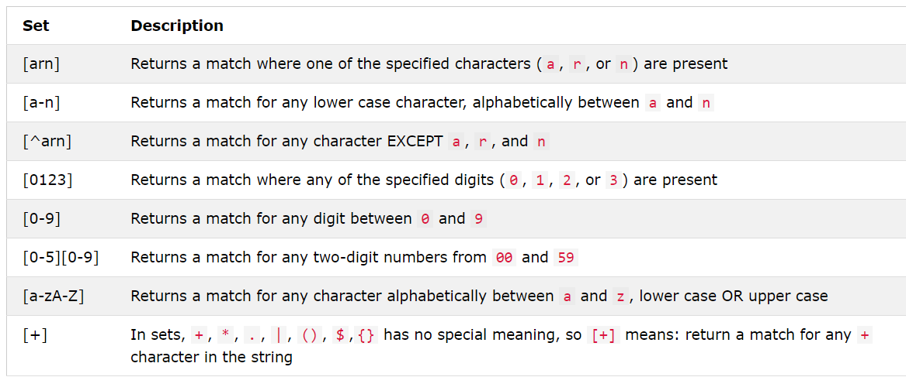

# Python Regular Expression

A RegEx, or Regular Expression, is a sequence of characters that forms a search pattern.
RegEx can be used to check if a string contains the specified search pattern.

## RegEx Module
Python has a built-in package called re, which can be used to work with Regular Expressions.

Import the re module:

` import re `

## RegEx in Python

When you have imported the re module, you can start using regular expressions:

Example
Search the string to see if it starts with "The" and ends with "Spain":

                        `
                        import re

                        txt = "The rain in Spain"
                        x = re.search("^The.*Spain$", txt)
                        `

## RegEx Functions

The re module offers a set of functions that allows us to search a string for a match:

## Metacharacters

Metacharacters are characters with a special meaning:

## Special Sequences

A special sequence is a \ followed by one of the characters in the list below, and has a special meaning:

## Sets

A set is a set of characters inside a pair of square brackets [] with a special meaning:

## The findall() Function

The findall() function returns a list containing all matches.

**Example**
Print a list of all matches:

                    `import re

                    txt = "The rain in Spain"
                    x = re.findall("ai", txt)
                    print(x)`

The list contains the matches in the order they are found.

If no matches are found, an empty list is returned:

**Example**
Return an empty list if no match was found:

                    `import re

                    txt = "The rain in Spain"
                    x = re.findall("Portugal", txt)
                    print(x)`

## The search() Function

The search() function searches the string for a match, and returns a Match object if there is a match.

If there is more than one match, only the first occurrence of the match will be returned:

**Example**
Search for the first white-space character in the string:

                    `import re

                    txt = "The rain in Spain"
                    x = re.search("\s", txt)

print("The first white-space character is located in position:", x.start())
If no matches are found, the value None is returned:`

**Example**
Make a search that returns no match:

                    `import re

                    txt = "The rain in Spain"
                    x = re.search("Portugal", txt)
                    print(x)`

# The split() Function

The split() function returns a list where the string has been split at each match:

**Example**
Split at each white-space character:

                    import re

                    `txt = "The rain in Spain"
                    x = re.split("\s", txt)
                    print(x)`
You can control the number of occurrences by specifying the maxsplit parameter:

**Example**
Split the string only at the first occurrence:

                    `import re

                    txt = "The rain in Spain"
                    x = re.split("\s", txt, 1)
                    print(x)`

# The sub() Function

The sub() function replaces the matches with the text of your choice:

**Example**
Replace every white-space character with the number 9:

                    `import re

                    txt = "The rain in Spain"
                    x = re.sub("\s", "9", txt)
                    print(x)`
You can control the number of replacements by specifying the count parameter:

**Example**
Replace the first 2 occurrences:

                    `import re

                    txt = "The rain in Spain"
                    x = re.sub("\s", "9", txt, 2)
                    print(x)`

# Match Object

A Match Object is an object containing information about the search and the result.

Note: If there is no match, the value None will be returned, instead of the Match Object.

**Example**
Do a search that will return a Match Object:

                    `import re

                    txt = "The rain in Spain"
                    x = re.search("ai", txt)
                    print(x) #this will print an object`

The Match object has properties and methods used to retrieve information about the search, and the result:

.span() returns a tuple containing the start-, and end positions of the match.
.string returns the string passed into the function
.group() returns the part of the string where there was a match

**Example**
Print the position (start- and end-position) of the first match occurrence.

The regular expression looks for any words that starts with an upper case "S":

                    `import re

                    txt = "The rain in Spain"
                    x = re.search(r"\bS\w+", txt)
                    print(x.span())`

**Example**

Print the string passed into the function:

                    `import re

                    txt = "The rain in Spain"
                    x = re.search(r"\bS\w+", txt)
                    print(x.string)`

**Example**

Print the part of the string where there was a match.

The regular expression looks for any words that starts with an upper case "S":

                    import re

                    txt = "The rain in Spain"
                    x = re.search(r"\bS\w+", txt)
                    print(x.group())

# High-level file operations in Python (shutil)

A number of functions for hgh level operations on files and directories have been defined in shutil module of Python’s standard library.

## copy()
This function copies a file to a specified file in same or other directory. First parameter to the function is a string representation of existing file. Second argument is either name of resultant file or directory. If it is a directory, the file is coped in it with same name. The metadata of original file is not maintained.

        >>> import shutil
        >>> shutil.copy("hello.py","newdir/")
        'newdir/hello.py'

## copy2()
This function is similar to copy() function except for the fact that it retains metadata of source file. For example the date modified property of resulting file will be similar to original file.

        >>> shutil.copy2('person.py', 'newdir/')
        'newdir/person.py'

## copyfile()
Two string arguments of this function represent file names.It means the original file is copied by the specified name in the same directory.

        >>> shutil.copyfile('start.py', 'end.py')
        'end.py'

## copyfileobj()
The parameters of this function are file objects rather than strings representing files. The file objects are obtained by open() function. Original file should have read permission and resulting file hould be opened with write permission.

        >>> f1=open('hello.py','r')
        >>> f2=open('python.py','w')
        >>> shutil.copyfileobj('f1', 'f2')
        >>> shutil.copyfileobj(f1, f2)

## move()
This function recursively moves file and directories from on directory to other.

        >>> shutil.move('hello.py', 'newdir/')
        'newdir/hello.py'
## copytree()
This function recursively copies file and subdirectories in one directory to another directory. Names of two parameters must be string. Directory of second parameter’s name should not exist earlier. To copy individual files copy2() function is internally used.

        >>> shutil.copytree('dir1','dir2')
        'dir2'

## rmtree()
This function removes files and subdirectories in the specified directory.

        >>> shutil.rmtree('dir2')
        >>> shutil.move('hello.py', 'newdir/')
        'newdir/hello.py'

## disk_usage()
This function retrieves usage statistics of directory given.

        >>> shutil.disk_usage('c:\\python36\\dir1')
        usage(total=245681352704, used=84932993024, free=160748359680)

## which()
This function returns path to an executable.

        >>> shutil.which('calc')
        'C:\\WINDOWS\\system32\\calc.EXE'

## make_archive()
This function builds an archive (zip or tar) of files in the root directory.

        >>> root_dir='newdir'
        >>> shutil.make_archive("newdirarch","zip",root_dir)
        'C:\\python36\\newdirarch.zip'

## get_archive_formats()
This function gives of all supported archive formats.

        >>> shutil.get_archive_formats()
        [('bztar', "bzip2'ed tar-file"), ('gztar', "gzip'ed tar-file"), ('tar', 'uncompressed tar file'), ('xztar', "xz'ed tar-file"), ('zip', 'ZIP file')]

## unpack_archive()
This functions extracts files in the given archive. Second parameter is the directory in which file are to be extracted. If not given, the unpacking is performed in current directory.

        >>> shutil.unpack_archive('newdirarch.zip','newdir')